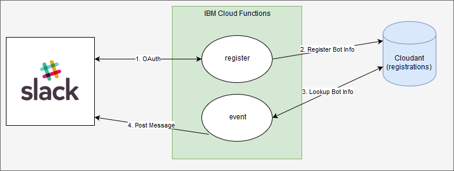
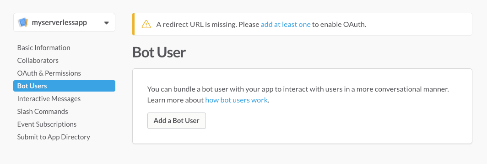
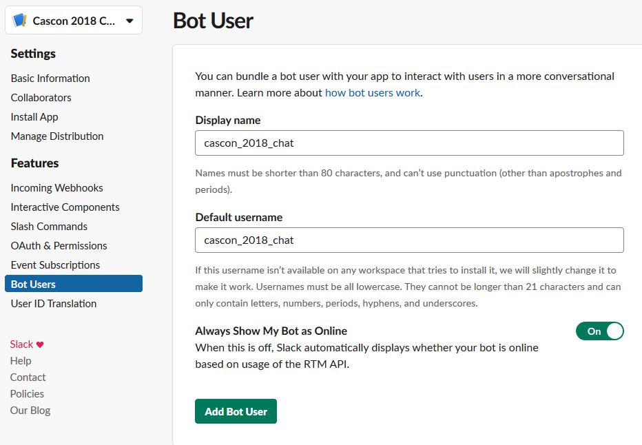
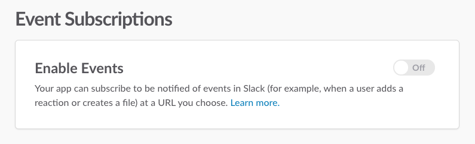
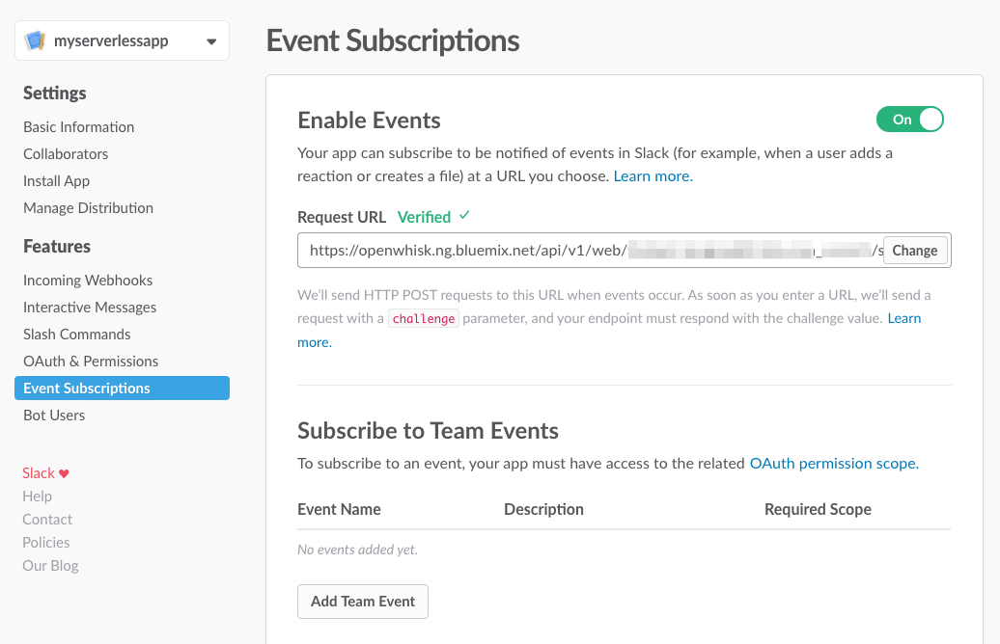
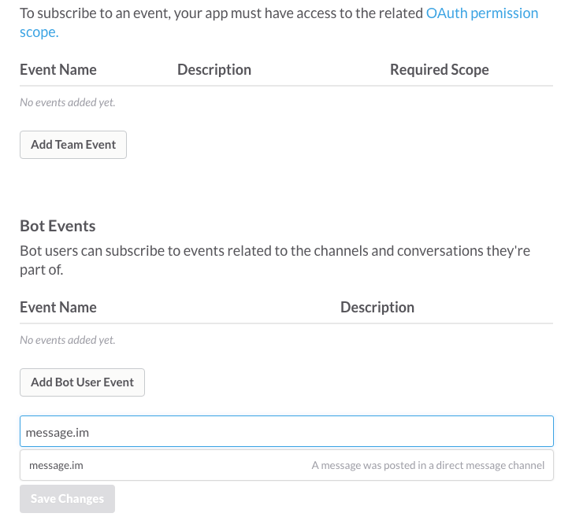
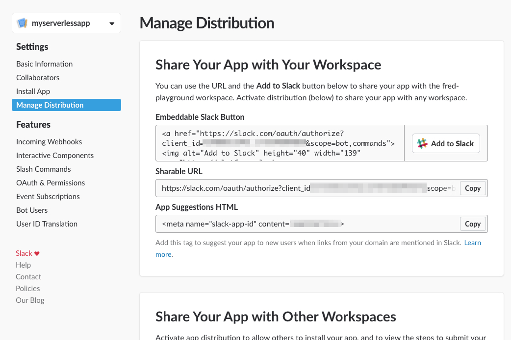
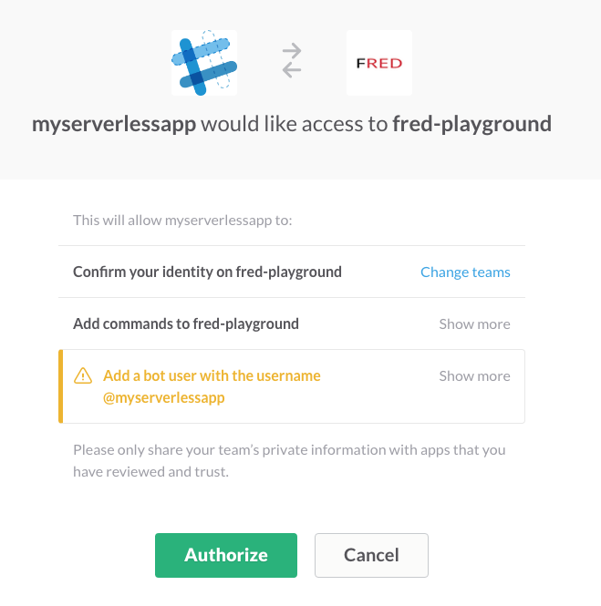

# Lab 01 - Step 01 - Basic Event

## Objective

To create a first version of the event handling function for Slack.

This version only responds to the user by repeating the information the bot received.



Note: Diagrams are created using https://www.draw.io/

## References

Slack Post a message API: https://api.slack.com/methods/chat.postMessage

Slack events: https://api.slack.com/events/message

## Steps

### Create the Cloud Function
1. Create actions directory
1. Create a file called slackapp-event.js. This is a IBM Cloud Functions Node.js action that is responsible for fetching Slack bot information that was saved to the Cloudant database during registration and listening and responding to Slack event.
1. Modify the code to do the following

   - Add a function that will post a message to the channel

   ```javascript
   /**
    * Posts a message to a channel with Slack Web API
    *
    * @param {String} accessToken - authorization token
    * @param {String} channel - the channel to post to
    * @param {String} text - the text to post
    * @param {function} callback - function(err, responsebody)
    * @returns {null} Nothing
    */
   function postMessage(accessToken, channel, text, callback) {
     request(
       {
         url: "https://slack.com/api/chat.postMessage",
         method: "POST",
         form: {
           token: accessToken,
           channel,
           text
         }
       },
       (error, response, body) => callback(error, body)
     );
   }
   ```

   - Add code to ignore certain event types

   ```javascript
   // Identify if there are message subtypes to ignore See https://api.slack.com/events/message for details
   const ignoreEventSubTypes = [
     "bot_message",
     "group_join",
     "channel_join",
     "group_leave",
     "channel_leave"
   ];

   if (_.includes(ignoreEventSubTypes, args.event.subtype, 0)) {
     // Console.log("This is message subtype we can ignore: ", args.event.subtype);
     return {
       statusCode: 200
     };
   }
   ```

   - Add code to reply to the user when a message is posted in the channel (leverage the method for posting above)

   ```javascript
   // Reply to the message
   function (registration, callback) {
     if (event.event.type === "message" && !event.event.bot_id) {
       console.log(`Processing message from ${event.event.user}: ${event.event.text}`);

       // This repeats the message from the use back to the channel and should likely not be used
       postMessage(
         registration.bot.bot_access_token, event.event.channel,
         `Hey ${event.event.user}, you said ${event.event.text}`,
         (err, result) => {
           callback(err);
         }
       );
       return true;
     }
     return callback(null);
   }
   ```
   
### Deploy the Cloud Functions as web actions
1) Deploy the function to IBM Cloud. You will be running the shell script deploy.sh that contains IBM Cloud Functions / OpenWhisk command line commands to create or delete a package and web actions.

   - Ensure your `ibmcloud wsk` command line interface is property configured with:

     ```
     ibmcloud wsk list
     ```

     This shows the packages, actions, triggers and rules currently deployed in your namespace.
     
   - Reuse the **parameters.json** configurations previously prepared from lab0, copying it to the same directory as your deploy.sh
     ```
     cp ../../lab00-preparation/parameters.json .
     ```

   - Create the actions:

     For linux or Mac user, you may need to add the execute permission first

     ```
     chmod +x deploy.sh
     ```

     ```
     chmod +x deploy.sh
     ./deploy.sh --install
     ```

     If all goes well it outputs:

     ```
     Creating slackapp package
     ok: created package slackapp
     Adding app registration command
     ok: created action slackapp/slackapp-register
     Adding app event processing
     ok: created action slackapp/slackapp-event
     Adding app command processing
     ok: created action slackapp/slackapp-command
     OAuth URL:
     https://openwhisk.ng.bluemix.net/api/v1/web/<org_space>/slackapp/slackapp-register
     Command URL:
     https://openwhisk.ng.bluemix.net/api/v1/web/<org_space>/slackapp/slackapp-command
     Event Subscription Request URL:
     https://openwhisk.ng.bluemix.net/api/v1/web/<org_space>/slackapp/slackapp-event
     ```

     > Note: the script can also be used to _--uninstall_ the Cloud Functions artifacts to _--update_ the artifacts if you change the action code.

### Add a Slack bot, a Slack event and register the Cloud Function with the event.
1. Go to your Slack API service page to add a bot user

   1. Click on **Bot Users** 

      

   1. Click **Add a Bot User**

   1. Name your bot, check the option to have your bot always online and click **Add Bot User**

      

1. In Slack add the event subscription

   1. Add an Event Subscription <a name="add_event_subcription"></a>

   1. Go to the **Event Subscriptions** section of your app

   1. Enable Events

      

   1. Set the Request URL to the URL of the `slack-event` web action. The URL should look like `https://openwhisk.ng.bluemix.net/api/v1/web/your-org_your-space/slackapp/slackapp-event`.
   
      You can run the command below to determine the Request URL:
      
      ```
        ./deploy.sh --install
      ```
      
      

      > Slack will contact this URL immediately. It should turn to **Verified** if the Cloud Functions configuration steps worked.

1. In Slack add the bot event

   1. Listen to Bot messages <a name="listen_bot_messages"></a>

   1. Add a new Bot User Event for `message.im`

   

   > This allows us to react to direct messages sent to a bot. We could select more event type but for our simple app will only deal with this one today.

   1. Repeat for the following events: **message.channels**, **message.groups**, **message.mpim**

   

   1. Save the changes

### Set the callback URL for authentication <a name="set_callback_url"></a>

1. Under OAuth and Permissions, add a new Redirect URL. This URL will be called when a user installs your application in a team. It should point to the `slackapp-register` web action. The URL should look like `https://openwhisk.ng.bluemix.net/api/v1/web/your-org_your-space/slackapp/slackapp-register`

   

1. Click **Save Changes**

Our app is finally ready to be installed!

## Add the app to your team (workspace) <a name="add_app_to_team"></a>

1. To see what's happening behind the scene as Slack calls our actions, open a new command prompt and run

   ```
   ibmcloud wsk activation poll
   ```

   > Leave it running. Actions triggered by Slack will show up there

1. Go to **Manage Distribution**

   

1. Click the **Add to Slack** button

1. Select the team where to install the app

1. Authorize the app

   

   After a few seconds, the app is installed. You should see logs appearing in the activation   polling as Slack will be sending the registration info we will use later to interact with Slack channels and users.

   In your web browser, you should see `Registration was successful. You can try the command in Slack or send a direct message to the bot.`

   Ideally you would redirect to another page once the registration is completed.


1. In Slack, add the bot to the channel
    1. Select the channel
    1. Click the cog wheel for "Channel Settings"
    1. Select "Invite new members to join..."
    1. Type the name of the bot and invite the bot to the channel
1. Type a message and get it sent back out to you

## Next Step

You are now ready to start <a href='../lab01-step02-getmoreinfo/README.md'>Lab 01 - Step 02 - Get more info</a>

