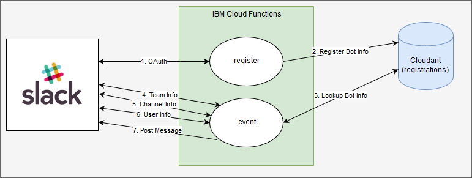

# Lab 01 - Step 02 - Get more information

## Objective

To call back to slack to get some additional information about the workspace, channel and user



Note: Diagrams are created using https://www.draw.io/

## References

Team Info API: https://api.slack.com/methods/team.info

Channel Info API: https://api.slack.com/methods/channels.info

User Info API: https://api.slack.com/methods/users.info

## Steps

1. For each of the API calls that you want to call to get more information, create a function with the following general structure

   ```javascript
   /**
    * Gets the details of a given team through the Slack Web API
   *
   * @param {String} accessToken - authorization token
   * @param {function} callback - function(err, team)
   * @returns {Object} the info - the information
   */
   function getInfo (accessToken, callback) {
     request({
       url: "https://slack.com/api/<API>",
       method: "POST",
       form: {
         token: accessToken
       },
       json: true
     }, (err, response, body) => {
       if (err) {
         return callback(err);
       } else if (body && body.ok) {
         return callback(null, body.<the info>);
       } else if (body && !body.ok) {
         return callback(body.error);
       }
       return callback("unknown response");
     });
   }
   ```

1. Solution

   i.  Create *teamInfo* Function
   ```javascript
   /**
    * Gets the details of a given team through the Slack Web API
    *
    * @param {String} accessToken - authorization token
    * @param {function} callback - function(err, team)
    * @returns {Object} team - team information
    */
   function teamInfo(accessToken, callback) {
     request(
       {
         url: "https://slack.com/api/team.info",
         method: "POST",
         form: {
           token: accessToken
         },
         json: true
       },
       (err, response, body) => {
         if (err) {
           return callback(err);
         } else if (body && body.ok) {
           return callback(null, body.team);
         } else if (body && !body.ok) {
           return callback(body.error);
         }
         return callback("unknown response");
       }
     );
   }
   ```

   ii.  Create *channelsInfo* Function
  ```javascript
   /**
    * Gets the details of a given channel through the Slack Web API
    *
    * @param {String} accessToken - authorization token
    * @param {String} channelId - the id of the channel to retrieve info from
    * @param {function} callback - function(err, channel)
    * @returns {Object} channel - channel information
    */
   function channelsInfo(accessToken, channelId, callback) {
     request(
       {
         url: "https://slack.com/api/channels.info",
         method: "POST",
         form: {
           token: accessToken,
           channel: channelId
         },
         json: true
       },
       (err, response, body) => {
         if (err) {
           console.log("channelsInfo Error", err);
           return callback(err);
         } else if (body && body.ok) {
           return callback(null, body.channel);
         } else if (body && !body.ok && body.error === "channel_not_found") {
           console.log("channelsInfo Channel Not Found", body.error);
           return callback(null, "Private Channel");
         } else if (body && !body.ok) {
           console.log("channelsInfo Body Not OK", body.error);
           return callback(body.error);
         }
         console.log("channelsInfo Unknown Response");
         return callback("unknown response");
       }
     );
   }
   ```
 
   iii.  Create *usersInfo* Function
  ```javascript
   /**
    * Gets the details of a given user through the Slack Web API
    *
    * @param {String} accessToken - authorization token
    * @param {String} userId - the id of the user to retrieve info from
    * @param {function} callback - function(err, user)
    * @returns {Object} user - user information
    */
   function usersInfo(accessToken, userId, callback) {
     request(
       {
         url: "https://slack.com/api/users.info",
         method: "POST",
         form: {
           token: accessToken,
           user: userId
         },
         json: true
       },
       (err, response, body) => {
         if (err) {
           return callback(err);
         } else if (body && body.ok) {
           return callback(null, body.user);
         } else if (body && !body.ok) {
           return callback(body.error);
         }
         return callback("unknown response");
       }
     );
   }
   ```

3. Reply more information


   i.  Reply *teamInfo*
   ```javascript
          function (registration, callback) {
          console.log("Looking up info for team", event.team_id);
          teamInfo(registration.bot.bot_access_token, (err, team) => {
            callback(err, registration, team);
          });
        },
   ```

   ii.  Reply *channelInfo*
   ```javascript
        function (registration, team, callback) {
          console.log("Looking up info for channel", event.event.channel);
          channelsInfo(registration.bot.bot_access_token, event.event.channel, (err, channel) => {
            callback(err, registration, team, channel);
          });
        },
   ```

  iii.  Reply *userInfo*
   ```javascript
        function (registration, team, channel, callback) {
          console.log("Looking up info for user", event.event.user);
          usersInfo(registration.bot.bot_access_token, event.event.user, (err, user) => {
            callback(err, registration, team, channel, user);
          });
        },
   ```

4. Modify the code to reply back with the real user name
   ```javascript
   // This repeats the message from the use back to the channel and should likely not be used
   postMessage(
     registration.bot.bot_access_token,
     event.event.channel,
     `Hey ${user.real_name}, you said ${event.event.text}`,
     (err, result) => {
       callback(err);
     }
   );
   ```
5. Deploy the update

   Reuse the **parameters.json** configurations previously prepared from lab0, copying it to the same directory as your deploy.sh
     ```
     cp ../../lab00-preparation/parameters.json .
     ```

   For linux or Mac user, you may need to add the execute permission first

   ```
   chmod +x deploy.sh
   ```

   Update with `./deploy.sh --update`

6. Go to the channel and type a message and get it replied back out to you
   1. Notice that the user real name is used in the reply

## Next Step

You are now ready to continue with one of the following:
- <a href='../lab02-handlingacommand/README.md'>Lab 02 - Handling a Command</a>
- <a href='../lab03-option01-savetocloudant/README.md'>Lab 03 - Option 01 - Save to Cloudant</a>
- <a href='../lab03-option02-watsonassistant/README.md'>Lab 03 - Option 02 - Watson Assistant</a>

