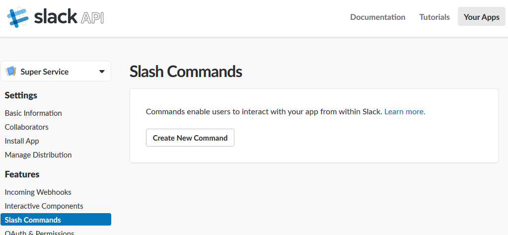
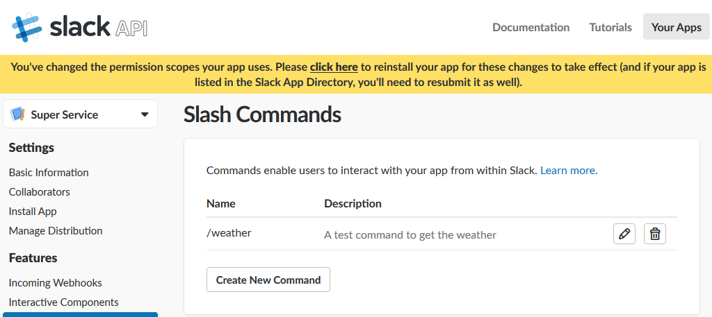
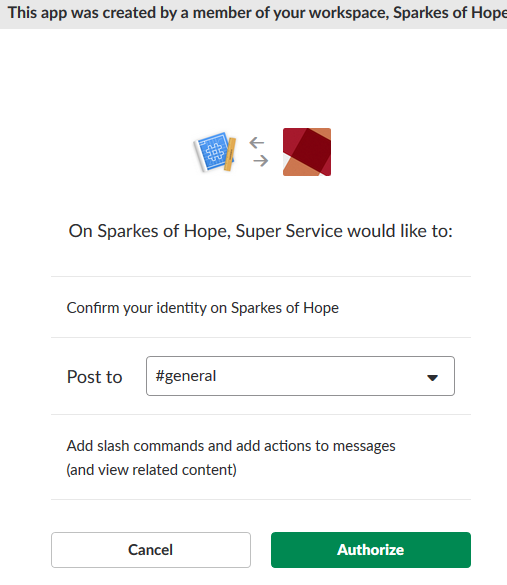

# Lab 02 - Handling a Command

## Objective

To create a function that handles a command coming from Slack.

**NOTE: The weather API used in this lab will only be temporarily available and will have to be remplaced by another API after CASCON 2018 closes**

## References

https://console.bluemix.net/docs/services/Weather/weather_tutorials_samples.html#using_location_services

## Steps

### Modify the slackapp-command.js 

1. The weather can be obtained by calling the following API:

```
https://casconweather.mybluemix.net/weather?address=${address}
```

where the `${address}` will be an address for which you want the weather.

Note that this API is a simplified API that does not require an API key or authentication which would be the case with a *real* API.

Inspire your code from the code created in the `slackapp-command.js` and call the API listed above, process the results and respond back to the user with the requested weather information.

Solution to call the Weather API:
```javascript
  const getWeather = (address, callback) => {
    request({
      url: `https://casconweather.mybluemix.net/weather?address=${address}`,
      json: true
    }, (error, response, body) => {

      if (error) {
        return callback("Unable to connect to Cascon Weather Server");
      } else if (response.statusCode === 400) {
        return callback("Invalid geolocation.");
      } else if (response.statusCode === 200) {
        console.log("Response: ", response);
        console.log("Body: ", body);
        try {
          return callback(undefined, {
            message: body.message,
            address: body.address,
            summary: body.weatherSummary,
            temperature: body.temperature
          });
        } catch (e) {
          return callback(e);
        }
      }
    });
  };
```

Solution to provide a response:
```javascript
// Reply to the message
function (registration, user, callback) {
    if (command.command === "/weather") {
    getWeather(command.text, (errorMessage2, resultingWeather) => {
        if (errorMessage2) {
        return callback(errorMessage2);
        }
        console.log("Before Reply: ", JSON.stringify(resultingWeather, undefined, 2));
        return callback(null, `Hey ${user.real_name}, the temperature at ${resultingWeather.address} is ${resultingWeather.summary} and ${resultingWeather.temperature} Celcius`);
    });
    } else {
    return callback("Un-implemented slash command!");
    }
}
```


### Modify the deployment script

1. Modify the `deploy.sh` script to include the command deployment
    (Uncomment the commands that refer to the slackapp-command.js)
   
1. Reuse the **parameters.json** configurations previously prepared from lab0, copying it to the same directory as your deploy.sh
     ```
     cp ../../lab00-preparation/parameters.json .
     ```
1. Deploy the command: `./deploy.sh --install`


### Create a new Slash command <a name="create_new_command"></a>
1. Go to https://api.slack.com and select *Your apps*

1. Under Slash Commands, **Create New Command**

   

1. Set the values

   1. Command: **/weather**

   1. Request URL: URL of the `slackapp-command` web action. The URL should look like `https://openwhisk.ng.bluemix.net/api/v1/web/your-org_your-space/slackapp/slackapp-command`

   1. Short Description: **A command that displays the weather for the address provided**

   1. Usage Hint: **[address]**

   

1. Save

1. If you see the following prompt (yellow), click the link

   


1. And confirm the identity of the service by clicking *Authorize*

    

1. Navigate to your Slack workspace and test your newly created Slash Command by typing

   ```
   /weather <some city>
   
   ```
   The Slash command executes and returns the weather for the city specified and responds with a message that looks:
   
   ```
   Hey <user name>, the temperature at <city> is <weather information returned>
   
   ```
   
