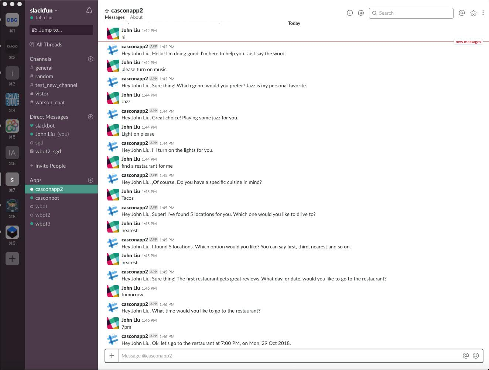

# Lab 03 - Option 2 - Watson Assistant

## Objective

Enhance the IBM function to call the Watson Assistant API to have a conversation in Slack.

## Architecture

The following shows the architecture at the end of this Lab.


Note: Diagrams are created using https://www.draw.io/

## Steps

1. cd to the *solution* directory

1. Copy the `template.parameters.json` found in the root directory to the *solution* directory. For example
    ```
    cp ../lab03-option02-watsonassistant/template.parameters.json parameters.json
    ```
1. Ensure the following settings are still correctly set (you will have to copy these settings from your previous lab).


   ```javascript
   "cloudantUrl": "YOUR_CLOUDANT_URL",
   "cloudantDb": "registrations",
   "slackClientId": "YOUR_SLACK_CLIENT_ID",
   "slackClientSecret": "YOUR_SLACK_CLIENT_SECRET",
   "slackVerificationToken": "YOUR_SLACK_VERIFICATION_TOKEN"
   ```

1. But leave the following section of the `parameters.json` as found to have the connection to the Watson Assistant parameters

    ```javascript
    "CONVERSATION_PASSWORD": "UgJVgytgCZlP",
    "CONVERSATION_USERNAME": "e4fee5c9-adf3-4388-a006-d96271930a95",
    "WORKSPACE_ID": "c7b1d638-721b-42a8-a509-6c779e9f68f4",
    "CONVERSATION_URL": "https://gateway.watsonplatform.net/assistant/api",
    "WATSON_COVERSATION_VERSION": "2018-02-16"
    ```
    - This is a preconfigure Watson Assistant instance that you will connect to and use. This instance will likely be unavailable at later dates. See the instructions on importing a configuration to set up your own instance.

1. Deploy the update

   For linux or Mac user, you may need to add the execute permission first

   ```shell
   chmod +x deploy.sh
   ```

   1. Uninstall with ./deploy.sh --uninstall (required because we need to re-create the package with the additional parameters.json file)
   2. Install with ./deploy.sh --install

1. Go to the channel and type a message and get it replied back out to you:

   Try the following messages:

   ```
     "hi",
     "please turn on music"
     "Jazz"
     "Light on please"
     "find a restaurant for me"
     "Tacos"
     "nearest"
     "tomorrow"
     "7pm"
     "Turn off the light"
     "Music off"
   ```

   

# Importing the Watson Assistant configuration 

To be completed
