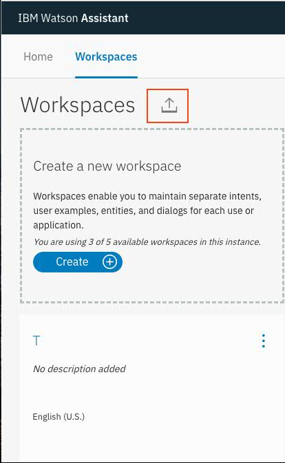

# Lab 03 - Option 2 - Watson Assistant

## Objective

Enhance the IBM function to call the Watson Assistant API to have a conversation in Slack.

## Architecture

The following shows the architecture at the end of this Lab.


Note: Diagrams are created using https://www.draw.io/

## Steps

1. Copy the **template.parameters.json** file to **solution/parameters.json**
2. cd the dirtory of solution
3. Copy the following parameters settings from lab01-step01-basicevent

   ```javascript
   "cloudantUrl": "YOUR_CLOUDANT_URL",
   "cloudantDb": "registrations",
   "slackClientId": "YOUR_SLACK_CLIENT_ID",
   "slackClientSecret": "YOUR_SLACK_CLIENT_SECRET",
   "slackVerificationToken": "YOUR_SLACK_VERIFICATION_TOKEN"
   ```

4. Deploy the update

   For linux or Mac user, you may need to add the execute permission first

   ```
   chmod +x deploy.sh
   ```

   1. Uninstall with ./deploy.sh --uninstall (required because we need to re-create the package with the additional parameters.json file)
   2. Install with ./deploy.sh --install

5. Go to the channel and type a message and get it replied back out to you:

   Try the following messages:

   ```
     "hi",
     "please turn on music"
     "Jazz"
     "Light on please"
     "find a restaurant for me"
     "Tacos"
     "nearest"
     "tomorrow"
     "7pm"
     "Turn off the light"
     "Music off"
   ```

   

We use a predefined Watson Asistant workspace for this workshop, so you do not need to handle the following steps, but it will be needed if you take use of your own Watson Assistant workspace.

1. Log in to IBM Cloud from a browser

2. Find Watson Asistant Service from the catalog and create a free version service.

3. Open the Watson Assistant Service and click on Launch Tool button.

4. After the tool is launched, go the the Workspace tab and click on the import icon as shown below.



5. Browse to the file of car_demo_watsonAssistant_wp.json and import it.

6. You will have the same Car_Demo workspace imported.

7, Update your parameters.json with your own Watson Assistan credentials and workspace id.
