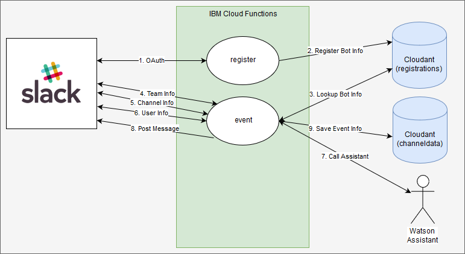

# Lab 03 - Option 2 - Watson Assistant

## Objective

Enhance the IBM function to call the Watson Assistant API to have a conversation in Slack.

## Architecture

The following shows the architecture at the end of this Lab.

Note: Diagrams are created using https://www.draw.io/

## Steps

1. 
